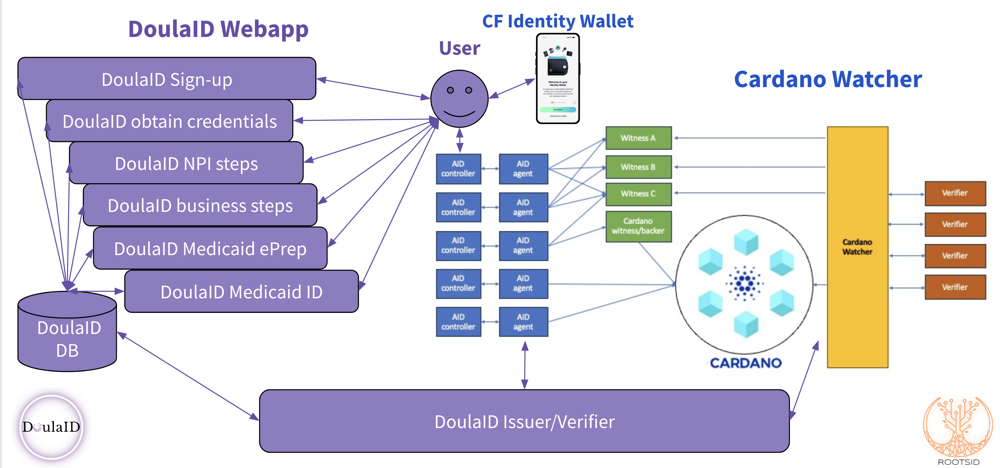
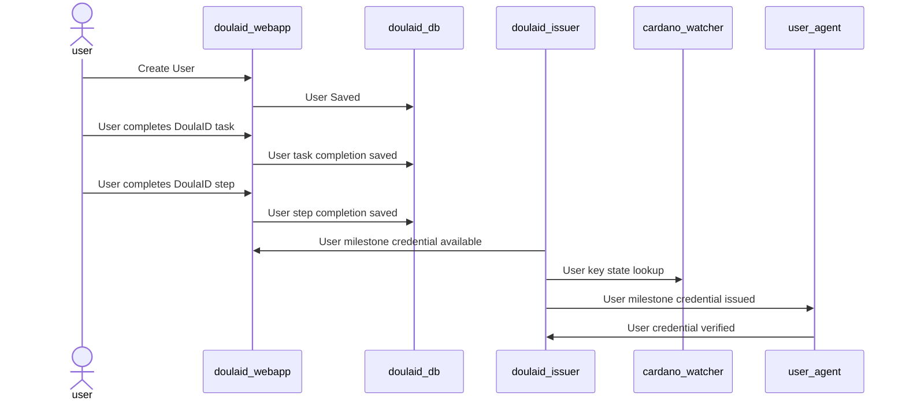

# DoulaID Design

## Ecosystem
The following diagram of a DoulaID webapp and the integration with the **Cardano Watcher** providing verification via the Cardano blockchain:

## Flow of events
The following sequence diagrams show a simplified flow of events for the registration, step completion, and verification of milestone completion:

### DoulaID user created, completed steps saved, and verifiable credentials issued

## Architecture
Webapp System requirements:
* DoulaID webapp available at known url and displayable in user browser
* DoulaID webapp database saves user progress
* DoulaID interacts with decentralized identifier for sign-in and to issue achivement verifiable credentials 
* DoulaID issuer/verifier verifies user key state seen in Cardano Watcher
