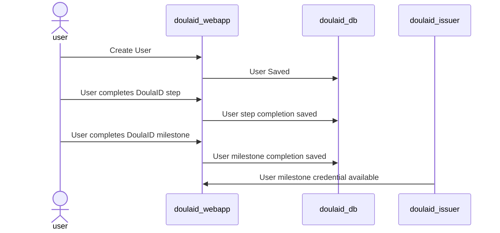

# DoulaID Design

## Ecosystem
The following diagram of a DoulaID webapp and the integration with the **Cardano Watcher** providing verification via the Cardano blockchain:

## Flow of events
The following sequence diagrams show a simplified flow of events for the registration, step completion, and verification of milestone completion:

### New DoulaID user created in DoulaID database

## Architecture
Webapp System requirements:
* DoulaID webapp available at known url and displayable in user browser
* DoulaID webapp database saves user progress
* DoulaID gives user option to create decentralized identifier and receive milestone achivement verifiable credentials

The following diagram shows the basic components of the system:

 
